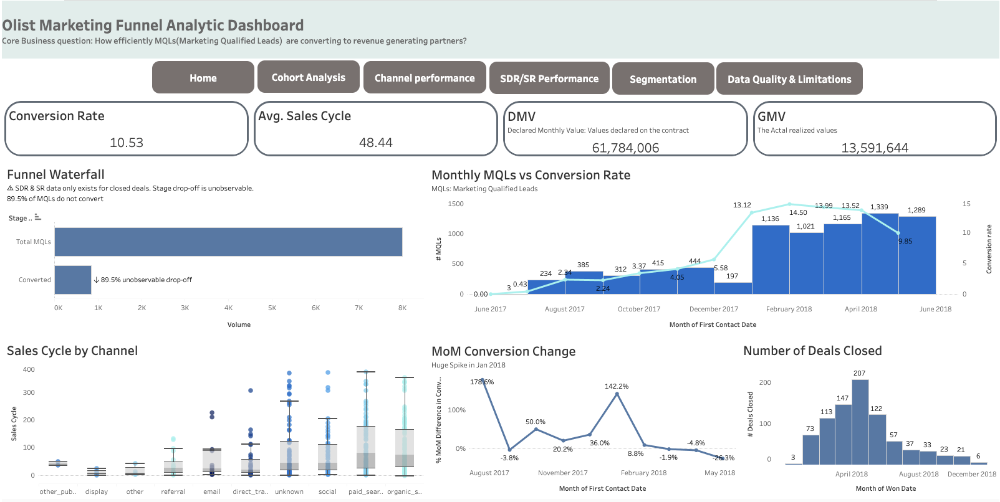
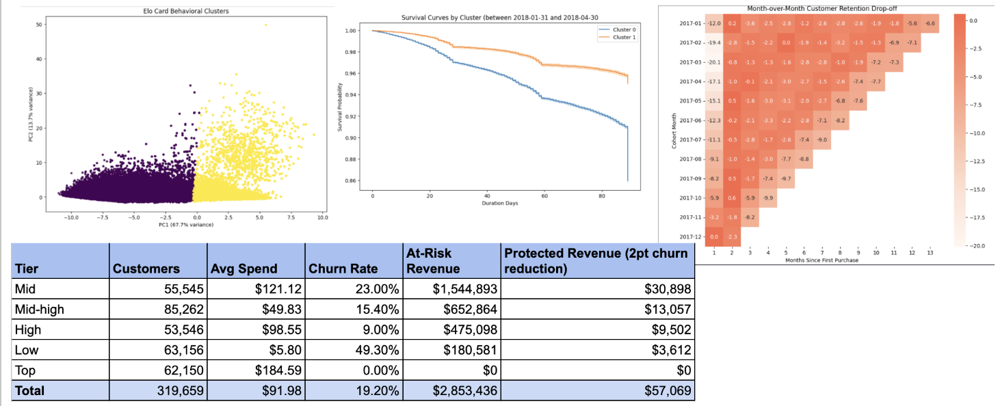
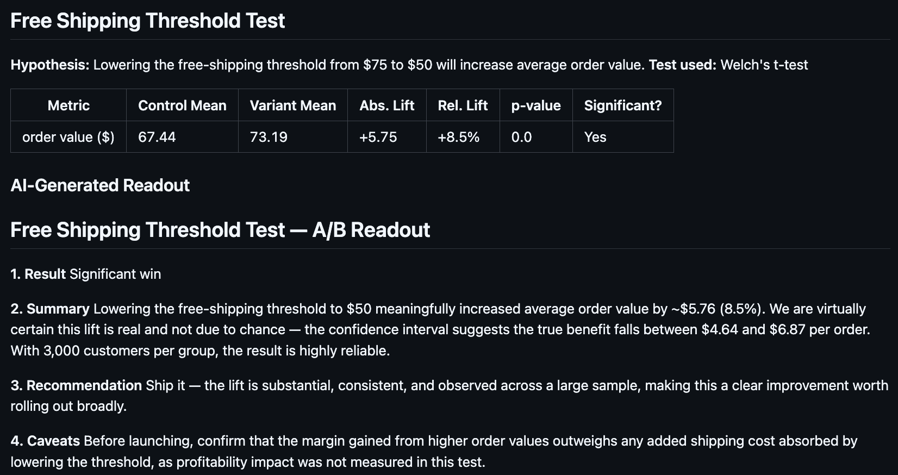
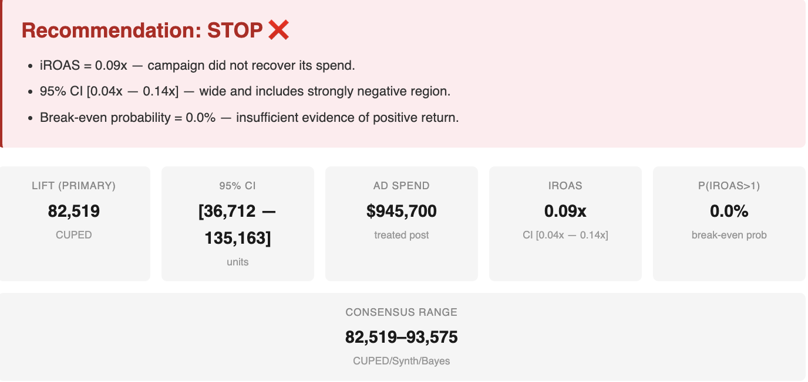
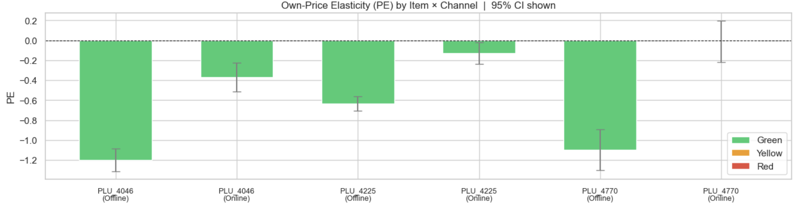
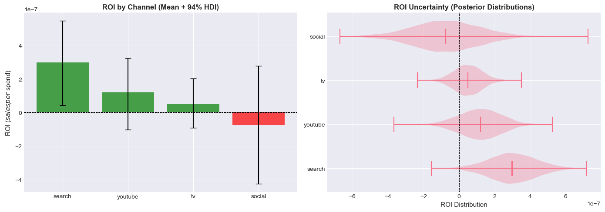

## Portfolio
# Explore My Work
### Causal Inference
Measure incremental business impact.
[Explore Causal Inference →](causal-inference)

---
## Marketing Funnel Analytics Dashboard
Delivered self-service Tableau dashboard analyzing seller acquisition funnel across 8K MQLs, 10 channels, and 25+ reps; uncovered social channel converting at half the funnel average and identified CRM instrumentation gap leaving 89.5% of lead drop-off unattributable by stage.
 
<a href="https://public.tableau.com/app/profile/amy7438/viz/OlistMarketingFunnelDashboard/Home">View dashboard on Tableau Public</a>

---
## End-to-End Ecommerce Analytics Warehouse (dbt + BigQuery)
Built a modular analytics engineering pipeline on Olist ecommerce data, transforming 100K+ transactional records into a tested star-schema warehouse with dbt (staging → intermediate → marts), enabling standardized KPIs across revenue, customer, product, and delivery performance analytics.
 
<a href="https://github.com/amytakeuchi/Olist-dbt-analytics-engineering">View code on Github</a>
 

---

## Product Analytics: Customer Retention & Behavioral Segmentation Analytics
Analyzed 300K+ cardholder transactions using RFM, survival analysis, and clustering to diagnose churn, model reactivation timing, and segment customers for targeted retention strategy.
 
<a href="https://github.com/amytakeuchi/Fintech-Product-Analytics/blob/main/README.md">View code on Github</a>
 

 

 
---

## AI-Powered Experiment Readout Generator
Built an automation pipeline turning raw A/B test results into stakeholder-ready decision readouts, routing each experiment to the correct significance test by metric type — two-proportion z-test for conversion metrics (click-through, retention, open rate), Welch's t-test for continuous metrics (order value, session duration) — then passing lift, confidence interval, and p-value to Claude to draft a plain-English summary and recommendation (ship / hold / kill). Includes inconclusive cases alongside clear wins to confirm the tool reasons about significance rather than defaulting to "ship it," with graceful degradation (template fallback if the LLM call fails) for unattended reliability.
 
<a href="https://github.com/amytakeuchi/experiment-readout-generator">View code on Github</a>
 

 

---
## Geo Incrementality Measurement — Causal Inference Pipeline
Built a production-style geo experiment pipeline across 60 markets, implementing five causal estimators in parallel (DiD, TBR, CUPED, CUPAC, Synthetic Control, Bayesian Hierarchical) to measure paid social incrementality. The core contribution is diagnosing and fixing systematic estimator failures — including a Synthetic Control scaling bug that collapsed RMSPE from 51,332 to 1,998 — rather than simply reporting a lift estimate. Three valid methods converged on 83K–94K incremental units against a 91.5K ground truth, with iROAS reported only when confidence intervals were available. End-to-end ownership from validity gating to business reporting layer.
 
<a href="https://github.com/amytakeuchi/Spillover-Aware-Geo-Incrementality-Experiment-Pipeline/tree/main">View code on Github</a>
 
Debugging write-up: <a href="https://medium.com/@a.takeuchi121/building-a-production-grade-geo-incrementality-system-how-synthetic-control-failed-by-18-and-bd497ebefa08"> Building a Production-Grade Geo Incrementality System: How Synthetic Control Failed by 18× — and What Fixed It →
</a>

<i>Summary of the Final Recommendation</i>

---
## Causal Price Elasticity Estimation — Double Machine Learning Pipeline
 Applied Double Machine Learning (DML) to 90,000+ weekly avocado price records across 54 U.S. markets to recover causally valid price elasticity and promotional demand multipliers — bypassing the endogeneity that invalidates standard regression for pricing decisions. Built the full two-stage pipeline from scratch: cross-fitted nuisance models with Fourier seasonality, geographic fixed effects, and channel-specific price controls, followed by OLS with HC3-robust standard errors and reliability flagging. A key debugging effort — identifying silent double-removal of geographic signal via the Frisch-Waugh-Lovell theorem — lifted nuisance R² by 94× (0.003 → 0.282), turning all six item × channel estimates from unreliable to green-flagged.
 
<a href="https://github.com/amytakeuchi/Avocado-Price-Elasticity-DML">View code on Github</a>
 
Debugging write-up: <a href="https://medium.com/@a.takeuchi121/debugging-a-broken-causal-pipeline-how-a-frisch-waugh-lovell-insight-lifted-r%C2%B2-from-0-003-to-0-282-88a1559341bf">Debugging a Broken Causal Pipeline: How a Frisch-Waugh-Lovell Insight Lifted R² from 0.003 to 0.282 →</a>

<i>Figure: Avocado Price Elasticity Estimation Results</i>

---
## Mobile Game A/B Testing
Designed an end-to-end hypothesis testing framework on 90,000+ player records to determine whether a monetisation gate at Level 30 vs. 40 maximises Day-1 and Day-7 retention for a top-grossing mobile puzzle game. Applied a two-proportion z-test with Bonferroni correction, randomisation validity checks, and bootstrap confidence intervals — grounded in behavioral economics (hedonic adaptation). Gate 30 delivered a statistically significant +18.2% lift in Day-7 retention (p < 0.01, 95% CI excludes zero), yielding a clear product recommendation tied directly to long-term LTV.

### [Project Summary Page](/ABTesting)
<a href="https://github.com/amytakeuchi/AB-Testing/tree/main">View code on Github</a>
  
 
 
---
## Bayesian Marketing Mix Modeling — Geo-Experiment Calibration
Built a production-grade Bayesian MMM in PyMC 5.0 on 156 weeks of spend data, featuring a custom fusion layer that uses Bayesian precision weighting to calibrate observational priors with experimental evidence — preventing over-correction from high-variance geo-tests. A trend component addition improved model R² by 58% (0.479 → 0.755), while geo-experiment calibration showed 0% R² change, redirecting a $500K experimentation budget toward data quality instead. The model identified TV at 85% saturation and, using 94% HDI uncertainty quantification, produced a risk-adjusted recommendation to reallocate spend toward high-ROI Search and YouTube.

<i>Figure: ROI by channel with 94% HDI and Posterior Distributions.</i>

<a href="https://github.com/amytakeuchi/Bayesian-MMM-Calibrated-with-Incrementality/blob/main/README.md#bayesian-marketing-mix-model-with-geo-experiment-calibration">View code on Github</a>  
Debugging write-up: <a href="https://medium.com/@a.takeuchi121/bayesian-mmm-case-study-why-model-specification-matters-more-than-you-think-e83408f79abb"> Bayesian MMM case study: Why Model Specification Matters More Than You Think →
 
# Other Past Projects
---
### Marketplace Listing Price Prediction

Built a two-part pricing intelligence system on 148K+ marketplace listings: a regression-based price recommendation engine using listing features (category, brand, condition, shipping) and an NLP pipeline using LDA topic modeling to surface the 10 dominant seller description clusters. t-SNE cluster analysis identified four high-signal, separable categories — deals/bundles, women's apparel, phones, and home goods — directly informing where category-specific pricing rules add the most business value. Findings revealed that 89%+ of listings contain fewer than 20 words, diagnosing a structural data quality gap with direct implications for seller tooling and model confidence.

  
<a href="https://github.com/amytakeuchi/Marketplace-price-prediction">View code on Github</a>

   
 
---
### Customer Churn Classification
A leading telecommunications company was facing high customer attrition and needed a way to identify which users were most likely to cancel their service based on customer behavior, contract type, and service usage.

In this project, I (1) conducted exploratory data analysis (EDA) and created 20+ visualizations to uncover key patterns in customer churn behavior, (2) engineered domain-specific features from raw customer data, assessed multicollinearity, and applied SMOTE to address class imbalance, (3) developed and compared Logistic Regression, Random Forest, XGBoost, and AdaBoost models using GridSearchCV, improving Logistic Regression accuracy from 0.26 to 0.81 and F1 score by 50% from 0.42 to 0.63. All modeling and analysis were performed in Python using Scikit-learn, XGBoost, and Pandas.

<a href="https://github.com/amytakeuchi/Customer-Churn-Classification">View code on Github</a>

---
### Healthcare Analytics
#### Diabetes Prediction
In this project, I created visualizations and built binary classification models using Logistic Regression, Random Forest, and Gradient boosting to predict diabetes using patient data. Involves data visualization and preprocessing in PCA and resampling using ADASYN.

<a href="https://github.com/amytakeuchi/Healthcare-Analytics/tree/main">View code on Github</a>

---
### Chicago Divvy bike share membership prediction
Divvy, a prominent bike share service offered in Chicago, offers annual membership while users have the option to use one-time payment as casual users. The provider is trying hard to convert casual users to subscribe to annual membership.

This project encompasses (1) extensive exploratory data analysis (EDA) on rideshare service data, employing statistical techniques and visualization tools to gain insights into user behavior and patterns.
(2) Developed a binary classification tool to predict the membership status of the users. Assessed 5 different Machine Learning models (Logistic Regression, KNN, Naive Bayes, Gradient Boosting, Random Forrest) and utilized the most effective model to enable targeted marketing for future strategic initiatives. Improved the training F1 score 33.3% by examining feature selection using Mutual Information.
(3) Retrieved, cleaned, and integrated Chicago's weather data using Python.

<a href="https://github.com/amytakeuchi/Bikeshare-Membership-Classification-analysis">View code on Github</a>

---
### Fintech Customer Segmentation and Clustering
ELo, the largest payment service in Brazil, has been partnering with merchants to offer promotions or discounts to cardholders. They are trying to understand the customer lifecycle to tailor their offers to individual purchase patterns.

Implemented customer cohort analysis, RFM segmentation, and K-means clustering methodology to understand purchasing patterns based on transaction history data with 1.9 million rows, enabling actionable insights for targeted marketing campaigns, personalized customer experiences, and identification of high-value customers.

<a href="https://github.com/amytakeuchi/Customer-Merchant-Cohort-and-Clustering">View code on Github</a>

---
### ETL project of invoice data
Extracted, cleaned, transformed, merged, and warehoused a dataset of retail inventory data.

  
<a href="https://github.com/amytakeuchi/ETL/tree/main">View code on Github</a>

